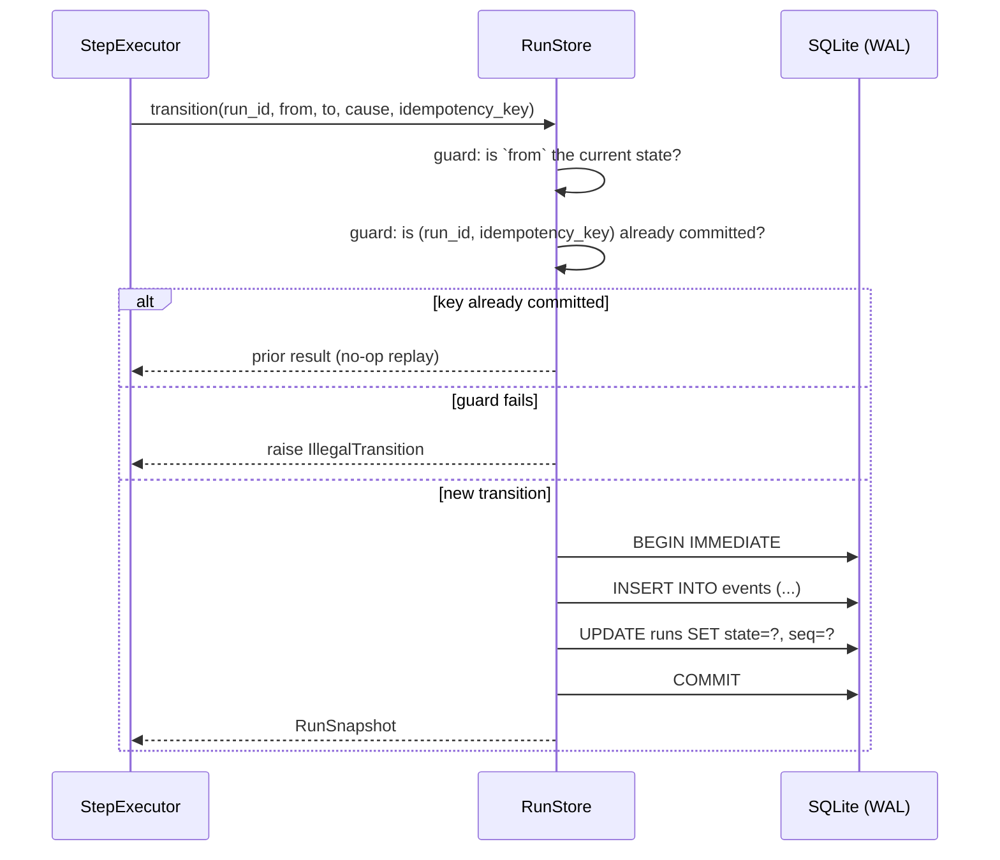
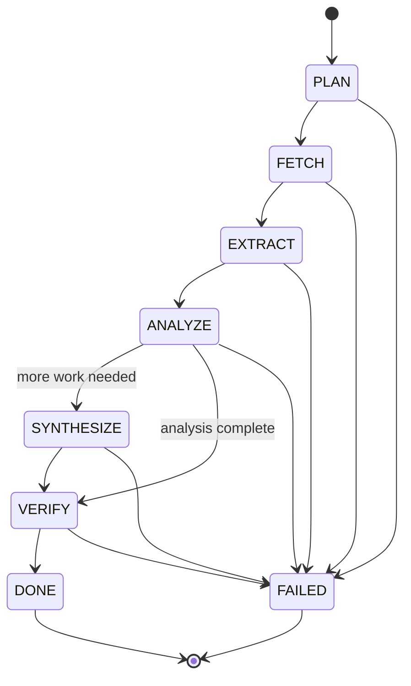
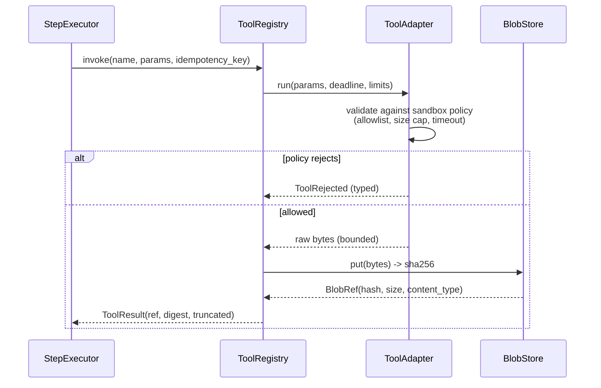
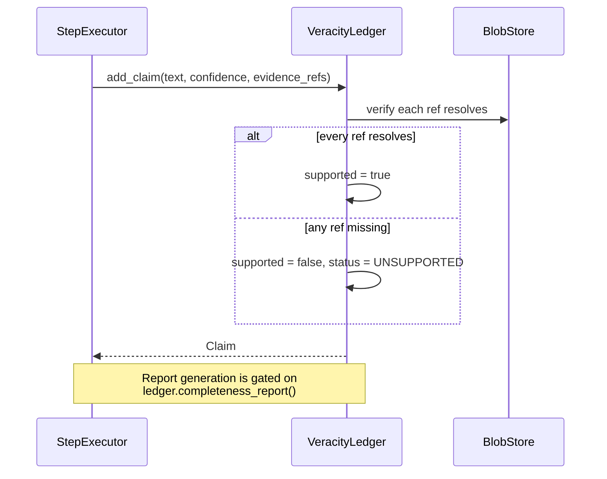

# ARCHITECTURE.md

Component reference for `deep-research-harness`. For the reasoning behind these choices, see
[DESIGN.md](DESIGN.md). For the decision log, see [DECISIONS.md](DECISIONS.md).

> Components are listed in build order. Each is a merged, green PR; nothing described here is
> aspirational. Current status is in [ROADMAP.md](ROADMAP.md).

---

## Module map

```
src/drh/
  __init__.py        package root, __version__
  cli.py             argparse CLI; thin shell over library code
  errors.py          typed exception hierarchy        [PR 2]
  types.py           pydantic domain models           [PR 3]
  providers/
    base.py          Provider protocol + request/response models   [PR 4]
    mock.py          MockProvider: deterministic, seeded, offline  [PR 4]
    openai_compat.py OpenAI-compatible HTTP adapter   [PR 5]
    anthropic.py     Anthropic Messages API adapter   [PR 5]
    ollama.py        Ollama HTTP adapter              [PR 5]
  store/
    base.py          RunStore protocol                [PR 6]
    sqlite_store.py  WAL-backed implementation        [PR 6]
    resume.py        resume + idempotency             [PR 7]
  executor.py        StepExecutor state machine       [PR 8]
  tools/
    base.py          ToolAdapter protocol             [PR 9]
    http_fetch.py    allowlisted HTTP fetch           [PR 9]
    file_read.py     path-jailed file read           [PR 9]
    subprocess_tool.py opt-in, timeout-bounded        [PR 9]
    blobstore.py     content-addressed evidence store [PR 9]
  ledger.py          VeracityLedger: claims + evidence [PR 10]
  report.py          report generation + gate         [PR 11]
  chaos.py           ChaosRunner crash injection      [PR 12]
```

---

## Component: RunStore

Owns all durable run state. The rest of the system never writes to the database directly.

### Invariants

1. Every state transition appends an event **and** updates the materialized row in one
   transaction. The log and the state cannot disagree.
2. Ordering uses a monotonic sequence number, never wall-clock time. Clock skew cannot reorder
   a run.
3. `resume(run_id)` is a pure function of the committed log.
4. `DONE` and `FAILED` are absorbing. A terminal run cannot transition again.

### Sequence: a single transition



The idempotency check is what makes retry-after-crash safe: if the side effect committed but the
process died before recording that fact, the retry recognizes the key and does not repeat the
side effect.

---

## Component: StepExecutor



`DONE` and `FAILED` are absorbing: no outgoing edges. Every transition is validated against
this table *before* it reaches the store, so an illegal transition is a typed error rather than a
corrupted run.

---

## Component: ToolSandbox



The executor never receives raw bytes for anything over the inline threshold. It receives a
`BlobRef`. This is what keeps context growth sub-linear over a long run.

---

## Component: VeracityLedger



A claim whose evidence does not resolve is not deleted — it is retained and marked
`UNSUPPORTED`. Deleting it would hide a research failure; the point is to surface it.
